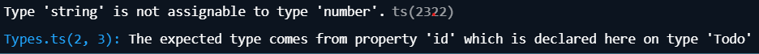

# Typescript Todo App

## A. Introduction
An Interface is a way to define the shape of an object. It specifies what properties an object should have and what types those properties should be. You can think of it as a blueprint that objects must follow. 

Interfaces help make your code less ptone to errors and easier to understand. They allow Typescript to catch errors before your code runs, which makes your program easier to run and easier to debug. 

### When/why to use Interface
1. Catch errors early:
    Typescript will warn you if you try to assign an object that doesn't match the interface. 
2. Allowing better code understanding:
    Interfaces solely focus on structure and type-checking aspects, allowing the developer to have a deeper understanding of code and validation.
3. Ensuring consistent object structure:
    Interfaces ensure that objects in your program follow a consistent structure.

## B. Common errors and troubleshooting
1. Forgetting *type* in an import:
    If you have an interface defined in types.ts like this:

    export interface Todo {
        id: number;
        title: string;
        completed: boolean;
    }

    And you try to import it like this into another file:

    import { Todo } from "./types"; 

    Typescript will give you this error:

    

    Why this happens:

    Typescript wants you to explicity mark imports that are only types to avoid potential runtime issues.

    Fixed mistake:

    

2. Wrong type for a property:

    If our interface is defined like this:

    interface todo {
        id: number;
        title: string;
        completed: boolean;
    }

    And we try to assign a wrong type for a property:

    const task: Todo {
        id: "one",       // This is wrong, id is set to have a vanlue of *number*, "one" is a *string*
        title: "Learn Typescript",
        completed: false,
    };

    Typescript will throw an error saying:

    

    Why this happens:

    This happens because we are trying to assign a *String* value, when we have specified to typescript we will be expecting a number.

    Fixed mistake:

    We fix the mistake by assigning id with the number 1.

3. Forgetting to mark optional properties:

    If we design our interface like this:

    interface Todo {
        id: number;                 // Required
        title: string;              // Required
        completed: boolean;         // Required 
        description: string;        //Required
    }

    Typescript will be expecting all these values to be filled. If we instead want *description* to be *optinal*, we need to assign it like this:

      interface Todo {
        id: number;                 // Required
        title: string;              // Required
        completed: boolean;         // Required 
        description?: string;       //Optional
    }

    Why this happens:

    This happens because Typescript enforces the shape of an interface strictly.

    Fixed mistake:

    Remember to mark the property as *optional* with a questionmark.

    --> description?: string;

## C. Completed program

    How are interfaces used in practise:

        1. Defining a consistent structire:

            In the porgram, we define a Todo interface:

            export interface Todo {
                id: number;
                text: string;
                completed: boolean;
            }

            This ensures that every Todo item we create has the same porperties (id, text and completed). If we forget a property, or assign it a wrong value, Typescript will warn us. 

        2. Type safetyy when manipulating data:

            Anwehere we use Todo[], Typescript checks that only valid todo objects are added or modified. 

            Example:

                const newTodo: Todo = { id: Date.now(), 
                text: input.value, 
                completed: false };
                todos.push(newTodo);

            If we try to add an object missing *completed* or with *id* as a string, Typescript will give an error. This prevents runtime bugs. 

        3. Easier collaboration and readability:

            If someone else works on our code, they immediately know the structure of todos. They can clearly see what porperties exist and what type each of them should be. 

        
        4. Scalability:

            If we later add more features, for example due dates or priority, we can simply extend the nterface.

            Example:

            interface Todo {
                id: number;
                text: string;
                completed: boolean;
                priority?: "low" | "medium" | "high"; // Optional
            }

# How to run our program

1. Clone the repository:

    Open your terminal and run:

    git clone https://github.com/williamwestergard/typescript-to-do-list-grupp-projekt.git
    cd typescript-to-do-list-grupp-projekt

2. Install dependencies:

    npm install

3. Start development server:

    npm run dev

# Exercise

Allow user ti edit the text if a todo after it's been created.

    Clues:

        1. Add an "Edit" button next to each todo in main.ts.
        2. When clicked, replace the text with an input field pre-filled with the current todo text. 
        3. Save changes back to the todos array when user clicks "Save button". 

